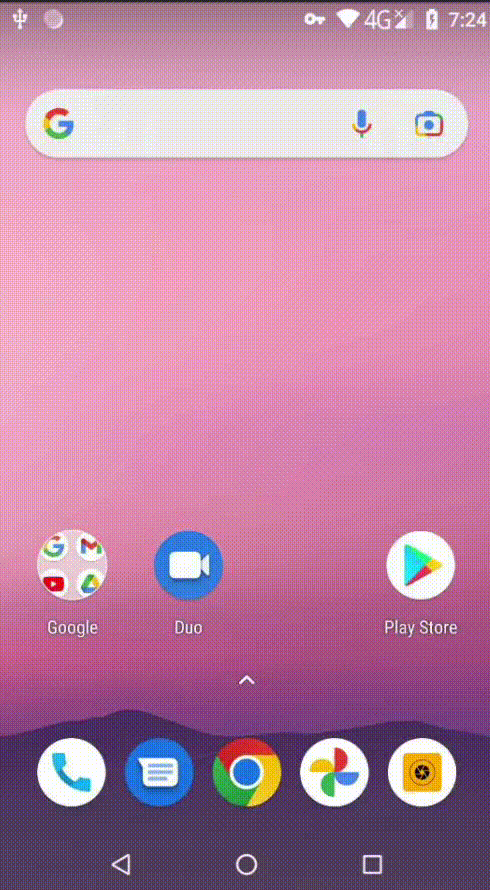

# RFID Reader

This is the Android application for the SmartSens project. 

## Communication with ThingsBoard

Edit the lines 41-43 of the app/src/main/java/com/example/myapplication/utilities/ThingsBoard.java to 
set the ThingsBoard URL and credentials:

```
username = sharedPreferences.getString("thingsboard-tenant-username", "tb-username");
password = sharedPreferences.getString("thingsboard-tenant-password", "tb-password");
url = sharedPreferences.getString("thingsboard-domain", "tb-url");
```  

## Installation of the debug APK


